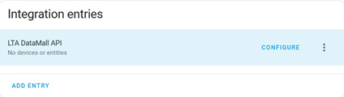

# SG Bus Arrivals

A custom integration for [Home Assistant](https://www.home-assistant.io/).
This integration uses the [LTA DataMall API](https://datamall.lta.gov.sg/content/datamall/en/dynamic-data.html) to fetch bus arrival times.

## Pre-requisites

To use this integration, you first need to get an **Account Key** by [requesting for LTA DataMall API access](https://datamall.lta.gov.sg/content/datamall/en/request-for-api.html).

## Installation

**Manual installation**

Copy the `custom_components/sg_bus_arrivals` folder and all of its contents into your Home Assistant's `/config/custom_components` folder.

## Adding the Integration

1. Login to your Home Assistant instance.
2. Go to **Settings** > **Devices & services**
3. Click on the **ADD INTEGRATION** button.
4. In the **Select brand** dialog, enter `SG Bus Arrivals` in the search box and select the integration.
5. Enter the **Account Key** (refer to the Pre-requisites section) when prompted and click on the **Submit** button to configure the integration.

## Configuration

After the integration has been added, you can configure the integration to add bus stops and bus services which will be exposed as a sensor to track bus arrival times.

1. Go to **Settings** > **Devices & services**.
2. Click on the **SG Bus Arrivals** integration.
3. Click on the **CONFIGURE** button to add a new bus stop.
