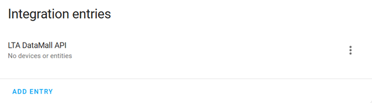

# SG Bus Arrivals


A custom integration for [Home Assistant](https://www.home-assistant.io/).
This integration uses the [LTA DataMall API](https://datamall.lta.gov.sg/content/datamall/en/dynamic-data.html) to fetch Singapore public transport information.

## Features

- Configure bus stops and bus services to expose sensors for tracking bus arrival times.
- Train service alerts are exposed as sensors to track train service disruptions. Each train line has it's own sensor for fine-gain control.

## Installation

You can install using either of the following methods:
- HACS installation (easiest)
- Manual installation

After installation is completed, continue with the [Configuration](#configuration) section below.

### HACS installation

[](https://my.home-assistant.io/redirect/hacs_repository/?owner=hanwg&repository=sg-bus-arrivals&category=integration)

### Manual installation

Copy the `custom_components/sg_bus_arrivals` folder and all of its contents into your Home Assistant's `/config/custom_components` folder.

## Configuration

Add the integration:
**Settings** > **Devices & services** > **ADD INTEGRATION** > **SG Bus Arrivals**

### Required manual input


- **API account key**: Used for authenticating with the LTA DataMall API. To get an API account key, you need to [request for LTA DataMall API access](https://datamall.lta.gov.sg/content/datamall/en/request-for-api.html).

- **Scan interval**: The frequency (seconds) to fetch data from the LTA DataMall API. A minimum limit of 20 seconds has been imposed to avoid rate-limiting issues.

Upon successful configuration, you should see a single **LTA DataMall API** entry.
Continue with the [Add new bus service](#add-new-bus-arrival-sensor) section below to add sensors for bus arrival times.<br/>


## Add new bus service

Go to **Settings** > **Devices & services** > **SG Bus Arrivals**.

Click on the "..." icon on the right of the **LTA DataMall API** entry and select **Add new bus service**.<br/>


### Required manual input

You will first be prompted to specify the bus stop code:<br/>


- **Bus stop code**: The unique 5-digit bus stop code. Use the [LTA Transport Tools (Bus Services)](https://www.lta.gov.sg/content/ltagov/en/map/bus.html) to search for your bus stops and bus services.

The integration will then fetch all the available bus services at that bus stop. Next, you will need to specify the bus service number:<br/>

- **Bus service number**: The bus service number at the bus stop.

After adding a bus service, you should be able to see a new subentry:<br/>


### Subentry details

Each subentry contains 3 services which corresponds to the 3 bus arrivals:


Selecting any of the service will display the details of the bus arrivals exposed as sensors:


🎉 Congratulations! You have successfully added a new service to track bus arrivals. You can add more bus services if you like or read on for more details about the integration.

## Add train service alerts

Go to **Settings** > **Devices & services** > **SG Bus Arrivals**.

Click on the "..." icon on the right of the **LTA DataMall API** entry and select **Add train service alerts**.
You should see a new **Train Service Alerts** subentry with a single service.

Click on the service to view all train service alert sensors:


Each train service alert sensor has either of the following states:
- `Normal` - Train service is operating as usual.
- `Disrupted` - Train service is delayed or trains are not available.

## Use cases

This section discusses some examples on how you can use this integration.

### Dashboard

Add the sensor to a dashboard to quickly view bus arrival times.
The folowing is an example from the default dashboard:<br/>


### Home Assistant Companion App (Android) Widget

Add a widget to your home screen to quickly peek at the next bus arrival:
1. Add an Home Assistant entity widget to your home screen.
2. Specify the estimated arrival sensor entity ID. e.g. `sensor.sgbusarrivals_01029_145_next_bus_1_estimated_arrival`
3. Tap on the widget to refresh the sensor display value.

### Automation: Send bus arrival notification when leaving home

This example automation sends a notification with the bus arrivals to your home assistant companion mobile app when you leave the house (i.e. disconnected from the home WiFi).
The notification is automatically dismissed after the timeout (120 seconds in this example) expires.

Update `your_device` and `your_wifi_ssid` accordingly.

automation.yaml:
```yaml
alias: "Away: Get bus arrivals"
description: ""
triggers:
  - trigger: state
    entity_id:
      - sensor.<your_device>_wifi_connection
    id: Away
    from: <your_wifi_ssid>
conditions: []
actions:
  - action: notify.mobile_app_<your_device>
    metadata: {}
    data:
      title: Bus Arrivals
      message: >-
        Bus 145: {{
        states('sensor.sgbusarrivals_01029_145_next_bus_1_estimated_arrival')
        }} / {{
        states('sensor.sgbusarrivals_01029_145_next_bus_2_estimated_arrival')
        }} / {{
        states('sensor.sgbusarrivals_01029_145_next_bus_3_estimated_arrival')
        }}
      data:
        tag: bus arrivals
        channel: Bus arrivals
        timeout: 120
        alert_once: true
mode: single
```
## Supported functionality

### Sensors

The bus arrival sensors are created via the [Add new bus service](#add-new-bus-service) setup. The estimated arrival sensor has the following properties:
- The sensor shows the **estimated** (as per LTA DataMall API) next bus arrival in minutes.
- The sensor has a precision of up to **1 minute** (as per LTA DataMall API).
- If the sensor shows `0`, it means the bus is arriving soon, is already at the bus stop or has just left the bus stop.
- If there are no more bus arrivals (e.g. last bus already departed), the sensor will show `Unknown`. If there was an error fetching the arrival time, the sensor will show `Unavailable`.


## Actions

The integration provides the following actions.

#### Action: Refresh bus arrivals

The `sg_bus_arrivals.refresh_bus_arrivals` action initiates a fetch using the LTA DataMall API to update all of the integration's sensors.

YAML:
```
action: sg_bus_arrivals.refresh_bus_arrivals
metadata: {}
data: {}
```

## Sensor naming and IDs

### Bus arrival sensors

Sensor entity IDs have the following naming convention: `sensor.sgbusarrivals_<bus_stop_code>_<service_no>_next_bus_<arrival>_<sensor>`<br/>
For example, for the 1st bus arrival for bus service number 145 at bus stop code 01029, the sensor entity id will be: `sensor.sgbusarrivals_01029_145_next_bus_1_estimated_arrival`

The available sensors are:
| Sensor            | Description                                                           |
|-------------------|-----------------------------------------------------------------------|
| estimated_arrival | The estimated number of minutes before the bus arrives.               |
| bus_type          | Bus type: `Single Deck`, `Double Deck` or `Bendy`                     |
| load              | Bus load: `Seats Available`, `Standing Available`, `Limited Standing` |
| feature           | Bus feature: `Wheel-chair accessible`                                 |

### Train service alerts sensors

Sensor entity IDs have the following naming convention: `sensor.sgbusarrivals_train_service_alert_<line>`

## Reconfiguration

This integration supports reconfiguration, allowing you to make changes to the **API account key** and **Scan interval**. Restart is not required upon successful reconfiguration.

## Removing the integration

Deleting the **LTA DataMall API** configuration entry will remove the integration.
ALL related services and sensors will also be deleted.

## FAQS

### How is the data fetched?

#### Bus arrivals

The **Scan interval** (default: 20 seconds) is configured during the integration setup.
This configures the frequency which the integration will poll from the LTA DataMall APIs to fetch the data.
For each bus stop specified, the integration makes a single API call to fetch bus arrival information.

Example 1:
You added 3 different bus services operating on the same bus stop - The integration makes **1**
API call every 20 seconds.

Example 2:
You added 3 bus services, all of them operating on different bus stops - The integration makes **3** API calls every 20 seconds.

#### Train service alerts
The data is fetched at a fixed interval of 10 minutes.