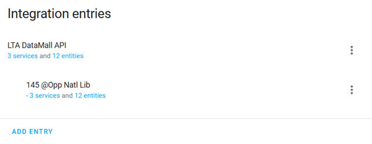
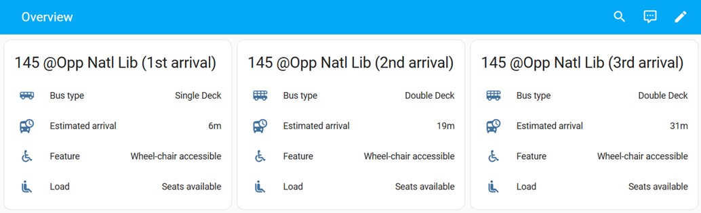

# SG Bus Arrivals


A custom integration for [Home Assistant](https://www.home-assistant.io/).
This integration uses the [LTA DataMall API](https://datamall.lta.gov.sg/content/datamall/en/dynamic-data.html) to fetch bus arrival times for all public bus services operating in Singapore.

## Installation

You can install using either of the following methods:
- HACS installation (easiest)
- Manual installation

After installation is completed, continue with the [Configuration](#configuration) section below.

### HACS installation

[](https://my.home-assistant.io/redirect/hacs_repository/?owner=hanwg&repository=sg-bus-arrivals&category=integration)

### Manual installation

Copy the `custom_components/sg_bus_arrivals` folder and all of its contents into your Home Assistant's `/config/custom_components` folder.

## Configuration

Add the integration:
**Settings** > **Devices & services** > **ADD INTEGRATION** > **SG Bus Arrivals**

### Required manual input


- **API account key**: Used for authenticating with the LTA DataMall API. To get an API account key, you need to [request for LTA DataMall API access](https://datamall.lta.gov.sg/content/datamall/en/request-for-api.html).

- **Scan interval**: The frequency (seconds) to fetch data from the LTA DataMall API. A minimum limit of 20 seconds has been imposed to avoid rate-limiting issues.

Upon successful configuration, you should see a single **LTA DataMall API** entry.
Continue with the [Add new bus service](#add-new-bus-arrival-sensor) section below to add sensors for bus arrival times.<br/>


## Add new bus service

Go to **Settings** > **Devices & services** > **SG Bus Arrivals**.

Click on the "..." icon on the right of the **LTA DataMall API** entry and select **Add new bus service**.<br/>


### Required manual input

You will first be prompted to specify the bus stop code:<br/>


- **Bus stop code**: The unique 5-digit bus stop code. Use the [LTA Transport Tools (Bus Services)](https://www.lta.gov.sg/content/ltagov/en/map/bus.html) to search for your bus stops and bus services.

The integration will then fetch all the available bus services at that bus stop. Next, you will need to specify the bus service number:<br/>

- **Bus service number**: The bus service number at the bus stop.

After adding a bus service, you should be able to see a new subentry:<br/>


### Subentry details

Each subentry contains 3 services which corresponds to the 3 bus arrivals:


Selecting any of the service will display the details of the bus arrivals exposed as sensors:


🎉 Congratulations! You have successfully added a new service to track bus arrivals. You can add more bus services if you like or read on for more details about the integration.

## Actions

These are service actions which you can use in automations.

### Refresh bus arrivals

This action initiates a fetch using the LTA DataMall API to update all of the integration's sensors.

YAML:
```
action: sg_bus_arrivals.refresh_bus_arrivals
metadata: {}
data: {}
```

## Use cases

This section discusses some examples on how you can use this integration.

### Dashboard

Add the sensor to a dashboard to quickly view bus arrival times.
The folowing is an example from the default dashboard:<br/>


### Home Assistant Companion App (Android) Widget

Add a widget to your home screen to quickly peek at the next bus arrival:
1. Add an Home Assistant entity widget to your home screen.
2. Specify the estimated arrival sensor entity ID. e.g. `sensor.sgbusarrivals_01029_145_next_bus_1_estimated_arrival`
3. Tap on the widget to refresh the sensor display value.

### Automation: Send bus arrival notification when leaving home

This automation sends a notification with the bus arrivals to your home assistant companion mobile app when you leave the house.

**Triggers**<br/>
The following trigger monitors the WiFi state of your phone using sensors from your home assistant companion mobile app. The trigger activates when you are disconnected from the given WiFi SSID (i.e. you left the house). Update `your_device` and `your_wifi_ssid` accordingly.
```
trigger: state
entity_id:
  - sensor.<your_device>_wifi_connection
from: <your_wifi_ssid>
```

**Actions**<br/>
The following action sends a notification to your home assistant companion mobile app. The notification is automatically dismissed after the timeout (120 seconds in this example) expires. Update `your_device`, `bus_stop_code` and `service_no` accordingly.
```
action: notify.mobile_app_<your_device>
data:
    title: Bus Arrivals
    message: >-
        {{ states('sensor.sgbusarrivals_<bus_stop_code>_<service_no>') }}
    data:
        tag: bus arrivals
        channel: Bus arrivals
        timeout: 120
        alert_once: true
```

## Supported functionality

### Sensors

The bus arrival sensor is created via the [Add new bus service](#add-new-bus-service) setup. The sensor has the following properties:
- The sensor shows the **estimated** (as per LTA DataMall API) next bus arrival in minutes.
- The sensor has a precision of up to 1 minute (as per LTA DataMall API).
- If the sensor shows "0", it means the bus is arriving soon, is already at the bus stop or has just left the bus stop.
- If there are no more bus arrivals (e.g. last bus already departed), the sensor will show "unknown". If there was an error fetching the arrival time, the sensor will show "unavailable".

## Sensor naming and IDs

Sensor entity IDs have the following naming convention: `sensor.sgbusarrivals_<bus_stop_code>_<service_no>_next_bus_<arrival>_<sensor>`<br/>
For example, for the 1st bus arrival for bus service number 145 at bus stop code 01029, the sensor entity id will be: `sensor.sgbusarrivals_01029_145_next_bus_1_estimated_arrival`

## Reconfiguration

This integration supports reconfiguration, allowing you to make changes to the **API account key** and **Scan interval**. Restart is not required upon successful reconfiguration.

## Removing the integration

Deleting the **LTA DataMall API** configuration entry will remove the integration.
ALL related services and sensors will also be deleted.
